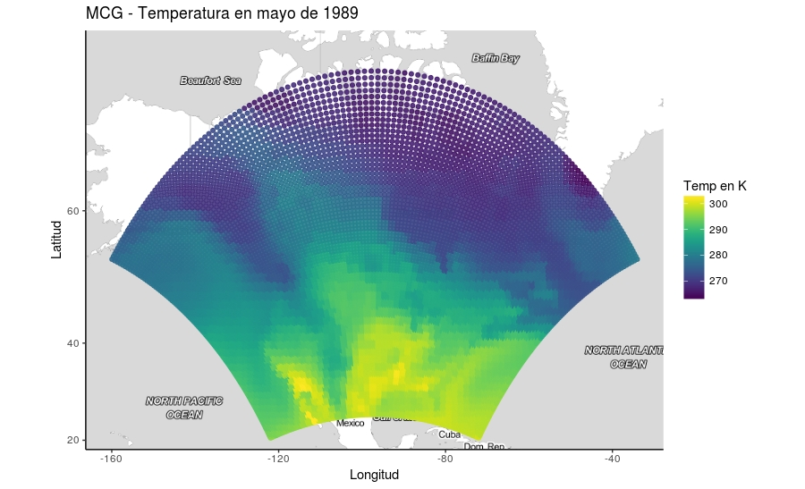
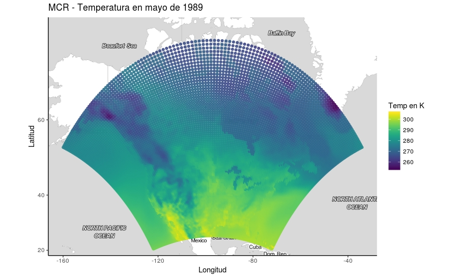
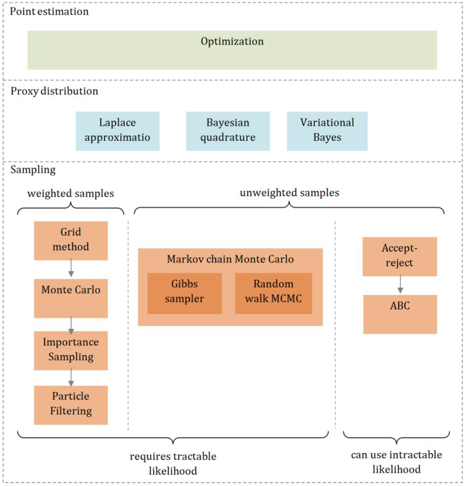

```{r setup, include=FALSE}
options(htmltools.dir.version = FALSE)
```

```{r xaringan-themer, include=FALSE}
library(xaringanthemer)
mono_light(base_color = "#23395b")
```

class: center, middle

# Proyecto B7166 


---

# Proyecto B7166 - objetivos

* Emulador de un modelo climático regional (RCM) que utiliza variables salida de un modelo de circulación global (GCM) como covariables y un marco estadístico Bayesiano para proveer una aproximación rápida a las variables de salida de un RCM. 

* El método es aplicado para emular la precipitación del modelo regional CRCM utilizando variables de salida del modelo global CCSM, utilizando datos del Programa Regional de Evaluación del Cambio Climático de América del Norte (NARCCAP) [Mearns, L.O., et al., (2014)](http://www.narccap.ucar.edu/about/citation.html)

* Principal reto es decribir de una manera computacionalmente eficiente, la relación entre los dos modelos con distinta resolución, tomando en cuenta la dependencia espacio-temporal.

---

# Proyecto B7166 - datos



---

# Proyecto B7166 - datos



--

$N  \sim 15000$ locaciones y $T = 360$ meses.

---

# Proyecto B7166 - modelo

Modelo usual:

Sea $Y_t(s)$ el output del modelo RCM para la locación $s$ con la resolución de RCM para el año $t$. $Y_t(s)$ se modela como:

$$ Y_t(s) = X_t(s)\beta  + \varepsilon_t(s)$$

donde $\varepsilon_t \sim GP(0, C(h,\Omega) )$ y $C(h,\Omega)$ es la función de covariancia espacial que describe el proceso espacial suavizado utilizando la distancia $h$ y un conjunto de parámetros $\Omega$. 

--

Pero: ¿qué pasa cuando se puede asumir que la tendencia temporal es distinta para cada locación s?

$$ Y_t(s) = X_t(s)\beta(s)  + \varepsilon_t(s)$$

donde $\beta(s) = \beta_0 + \beta_1(s)$ y $\beta_1 \sim GP(0, C(h,\Omega) )$ y $C(h,\Omega)$, además, el error $\varepsilon_t(s) \sim GP(0,I\sigma^2)$ . 

---

```{r, out.width = "550px", echo=FALSE}

```


Fuente: Shubin (2016) https://bit.ly/2G7GJb5
---

# Proyecto B7166 - estimación


* INLA: Aproximación de Laplace 

* TF: MCMC utilizando Tensor Flow 

* STAN: MC Hamiltoniano (uso de gradientes)


Estudio en curso: ¿Cuál algoritmo es computacionalmente más eficiente, y al mismo tiempo captura de la mejor manera la estructura de dependencia espacio-temporal para N > 3000, T > 12?

--

## -> Resultados estarán listos al final de este año <- ##
---


# Proyecto B7166 - resultados


### Flujo de trabajo

* El código está escrito para extraer precipitación del modelo regional CRCM y del modelo global CCSM, utilizando datos de NARCCAP.

* El objetivo es crear un paquete ROpenSci que permita repetir el proceso con distintos RCMs y GCMs.

---
class: inverse, center, middle

# Si existen tantas opciones de aprendizaje de máquina, ¿por qué preocuparse por la opción Bayesiana o por la opción de estimación que no es solamente puntual? 

---

```{r, out.width = "550px", echo=FALSE}

```


Fuente: Shubin (2016) https://bit.ly/2G7GJb5

---

# Caracterización de la incertidumbre 

$$ Y_t(s) = X_t(s)\beta(s)  + \varepsilon_t(s)$$

Estimar $\beta(s)$ puntualmente no es problema, el problema es determinar si hay evidencia o no para decir que es distinta a cero en cada locación.

--

### Un cálculo que ignore la dependencia espacial en este caso, puede cambiar las conclusiones.

Algunas soluciones para grandes datos: Heaton et al (2018) https://arxiv.org/abs/1710.05013?context=stat

---

# Posibles colaboraciones 

## ¿En qué podemos trabajar en conjunto?

(1) Aplicaciones para las técnicas computacionalmente eficientes para la estimación de estructuras de dependencia espacio-temporales.

(2) Crear un flujo de trabajo reproducible para el tratamiento de estos datos.

Pregunta de interés estadístico:

### ¿Cómo modelar estadísticamente la dependencia espacio-temporal, de una manera computacionalmente eficiente?


---

class: center, middle

# ¡Gracias!

Presentación creada con el paquete de R [**xaringan**](https://github.com/yihui/xaringan).


